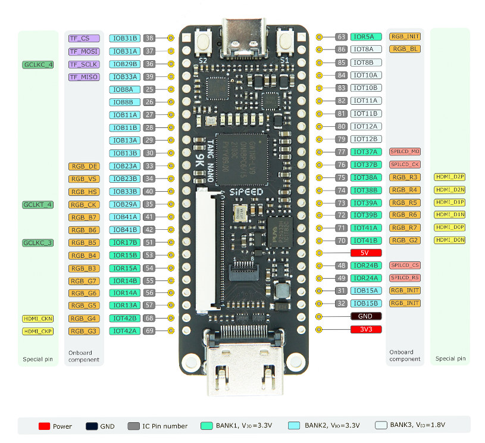
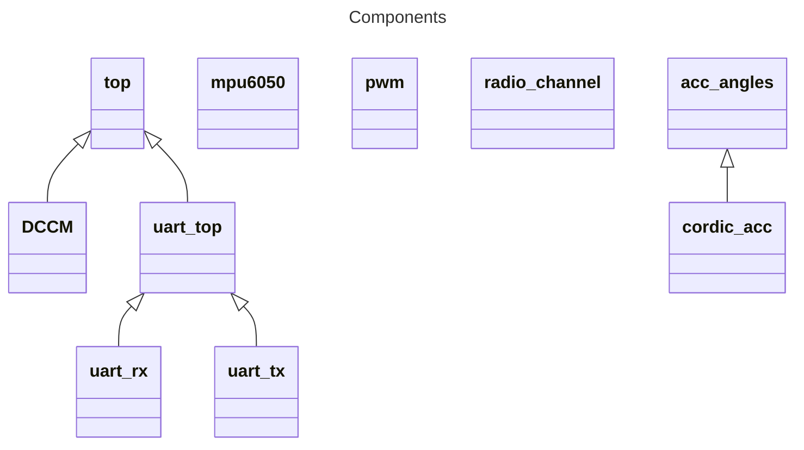

# System Overview
Board: Tang Nano 9

Ports used:
|Port |Function | Bank
--- | --- | --- |
|4|Reset|
|10|Builtin LED|
|11|Builtin LED|
|13|Builtin LED|
|14|Builtin LED|
|15|Builtin LED|
|16|Builtin LED|
|17|TX|
|18|RX|
|31|Gyro SDA|2
|32|Gyro SCL|2
|33|GPS TX|2
|34|GPS RX|2
|41|Magnetometer SDA|2
|42|Magnetometer SCL|2
|51|Motor 1|1
|52|Clk|
|53|Motor 2|1
|54|Motor 3|1
|55|Motor 4|1
|56|Motor 5|1
|57|Motor 6|1
|68|Motor 7|1
|69|Motor 8|1
|70|Radio 1|1
|71|Radio 2|1
|72|Radio 3|1
|73|Radio 4|1
|74|Radio 5|1
|75|Radio 6|1
|76|Radio 7|1
|77|Radio 8|1
|||
|||
|||
|||

