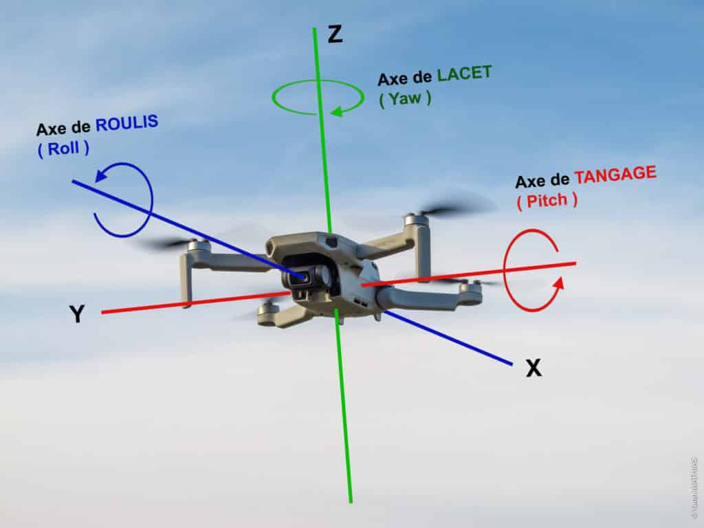
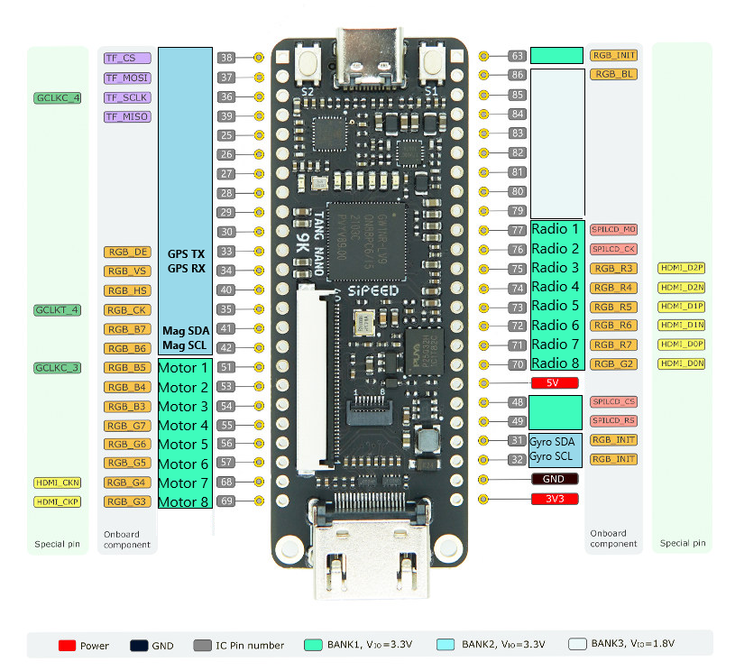
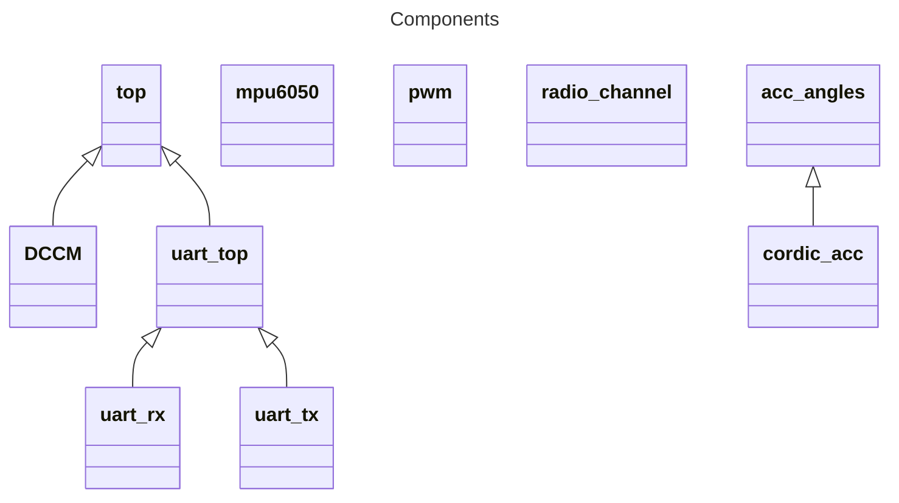

# System Overview

Source: https://www.libreinfo.org/comment-fonctionne-un-drone-quadrirotor/

## TODO
- Test PID
- ***More better filter with GYYYYRO***

Board: Tang Nano 9

Ports used:
|Port |Function | Bank | Comment
--- | --- | --- | --- |
|4|Reset|
|10|Builtin LED|
|11|Builtin LED|
|13|Builtin LED|
|14|Builtin LED|
|15|Builtin LED|
|16|Builtin LED|
|17|TX|
|18|RX|
|31|Gyro SDA|2
|32|Gyro SCL|2
|33|GPS TX|2
|34|GPS RX|2
|41|Magnetometer SDA|2
|42|Magnetometer SCL|2
|-|Motor 1|1|Front Left
|52|Clk|
|-|Motor 2|1|Front Right
|-|Motor 3|1|Rear Left
|-|Motor 4|1|Rear Right
|38|Motor 5|1
|37|Motor 6|1
|39|Motor 7|1
|36|Motor 8|1
|70|Radio 8|1|Extra
|71|Radio 7|1|Extra
|72|Radio 6|1|Left Knob [CCW 1017 - CW 1976]
|73|Radio 5|1|Right Knob [CCW 1016 - CW 1976]
|74|Radio 4|1|Right Horizontal [Left 1155 - Right 1872]
|75|Radio 3|1|Right Stick Vertical [Down 1850 - Up 1195]
|76|Radio 2|1|Left Stick Vertical [Down 1080 -  Up 1870]
|77|Radio 1|1|Left Stick Horizontal [Left 1058 - Right 1957]
|26|mpu interrupt|2
|24|debug|2
|||
|||

